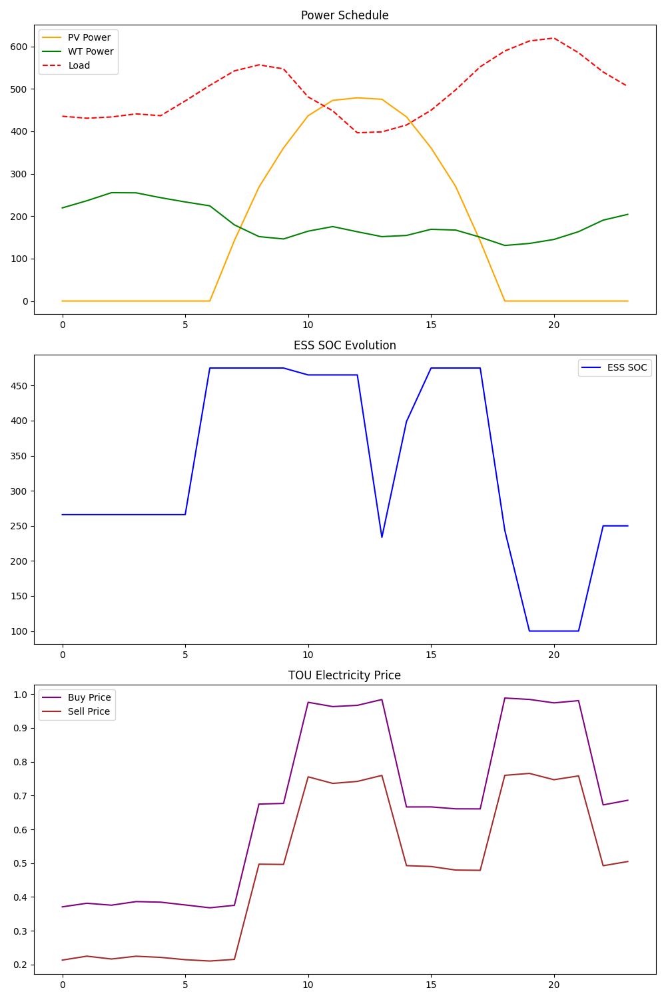

# Smart-Grid-Optimization

This repository presents a day-ahead economic dispatch workflow for a grid-connected microgrid with photovoltaic generation, wind generation, battery energy storage, and limited demand response. The core use case is economic optimization under time-of-use pricing, with particular emphasis on battery arbitrage: charging when energy is inexpensive or abundant, and discharging when the value of energy is highest.

The project is implemented as a reproducible three-step pipeline:

```bash
python data_generator.py
python optimizer.py
python visualizer.py
```

## 1. Background

Industrial and commercial microgrids increasingly operate in environments with volatile net load, renewable intermittency, and time-varying electricity prices. In that setting, operating strategy matters as much as installed equipment. A battery is valuable not only as a reliability asset, but also as an economic asset that can shift energy across time.

This project models that problem as a 24-hour day-ahead scheduling task. Given forecasts for PV output, wind output, site load, and buy/sell electricity prices, the optimizer determines:

- how much renewable generation to use,
- when to buy from or sell to the grid,
- when the battery should charge or discharge,
- and how much flexible load can be curtailed within policy limits.

The objective is to minimize total daily operating cost while preserving realistic physical and market constraints. In practice, that means the battery is used to capture arbitrage value across valley, flat, and peak pricing periods, while also absorbing midday renewable surplus when economically justified.

## 2. Mathematical Formulation (MILP)

The dispatch model is formulated as a mixed-integer linear program (MILP) over a 24-hour horizon.

### Objective

Minimize total daily operating cost:

\[
\min \sum_{t=1}^{24}
\left(
P_{buy,t}\lambda_{buy,t}
- P_{sell,t}\lambda_{sell,t}
+ c_{deg}(P_{ch,t}+P_{dis,t})
+ c_{dr}P_{curt,t}
\right)
\]

Where:

- \(P_{buy,t}\), \(P_{sell,t}\): grid import and export power
- \(P_{ch,t}\), \(P_{dis,t}\): battery charge and discharge power
- \(P_{curt,t}\): curtailed load
- \(\lambda_{buy,t}\), \(\lambda_{sell,t}\): time-varying buy and sell prices
- \(c_{deg}\): battery degradation cost coefficient
- \(c_{dr}\): demand response compensation cost coefficient

This objective explicitly captures the economics of battery arbitrage. The optimizer weighs low-price charging and high-price discharging against battery cycling cost, rather than assuming battery usage is always beneficial.

### Core constraints

#### Power balance

\[
P_{pv,t}+P_{wt,t}+P_{buy,t}+P_{dis,t}
=
(P_{load,t}-P_{curt,t})+P_{sell,t}+P_{ch,t}
\]

#### Grid import/export exclusivity

\[
0 \le P_{buy,t} \le U_{buy,t}P_{grid}^{max}
\]

\[
0 \le P_{sell,t} \le U_{sell,t}P_{grid}^{max}
\]

\[
U_{buy,t}+U_{sell,t}\le1
\]

#### Battery charge/discharge exclusivity

\[
0 \le P_{ch,t} \le U_{ch,t}P_{ess}^{max}
\]

\[
0 \le P_{dis,t} \le U_{dis,t}P_{ess}^{max}
\]

\[
U_{ch,t}+U_{dis,t}\le1
\]

#### Battery state of charge dynamics

\[
E_t = E_{t-1} + ( \eta_{ch}P_{ch,t} - P_{dis,t}/\eta_{dis})\Delta t
\]

\[
E^{min}\le E_t \le E^{max}
\]

\[
E_{24}=E_0
\]

The terminal SOC constraint prevents the optimizer from artificially emptying the battery at the end of the horizon to reduce reported cost.

#### Demand response limits

\[
0 \le P_{curt,t} \le \alpha P_{load,t}
\]

\[
\sum_t P_{curt,t} \le \beta \sum_t P_{load,t}
\]

These constraints limit both hourly and daily curtailment, keeping demand response as a bounded economic flexibility option rather than a free substitute for supply.

## 3. Implementation

The repository separates the workflow into three small, focused modules.

### `data_generator.py`

Generates a synthetic 24-hour forecast dataset with:

- a PV profile with daytime concentration,
- a smoothed wind profile,
- a load curve with morning and evening peaks,
- and valley/flat/peak time-of-use prices.

Output:

- `day_ahead_data.csv`

### `optimizer.py`

Builds and solves the MILP in `cvxpy`. The implementation includes:

- continuous variables for renewable utilization, grid exchange, battery operation, SOC, and curtailed load,
- binary variables for buy/sell and charge/discharge exclusivity,
- SOC dynamics and terminal SOC closure,
- explicit grid, battery, and demand response cost terms,
- solver fallback across `HIGHS`, `GLPK_MI`, `CBC`, and `ECOS_BB`,
- and post-solve validation of balance and exclusivity constraints.

Output:

- `schedule_result.csv`

Key configuration values in the current implementation include:

- grid exchange limit: `600 kW`
- battery power limit: `220 kW`
- battery energy capacity: `500 kWh`
- SOC operating range: `20%` to `95%`
- initial SOC: `50%`

### `visualizer.py`

Creates a compact summary figure covering:

- renewable generation and load profiles,
- battery SOC trajectory,
- and time-of-use electricity prices.

Output:

- `schedule_visualization.png`

## 4. Results

The repository includes a solved sample case and corresponding visualization:



The current run produces a daily optimal cost of approximately `2260.66 CNY`, as recorded in [`schedule_result.csv`](/home/ubuntu/.openclaw/workspace/Smart-Grid-Optimization/schedule_result.csv).

The dispatch pattern is economically intuitive:

- During low-price valley hours, the optimizer imports power and charges the battery.
- Around high-price peak periods, the battery discharges and the system exports excess renewable energy when available.
- Midday PV and wind reduce grid dependence and create opportunities to monetize surplus generation.
- Demand response is used sparingly and mainly during expensive evening peak hours, indicating that the battery and renewable portfolio absorb most of the economic optimization burden.

This is exactly the behavior expected from a battery-arbitrage-oriented scheduler: the battery shifts energy from lower-value hours to higher-value hours while respecting efficiency losses, SOC bounds, and cycling cost.

## 5. Future Work

- Add benchmark comparisons against a no-storage or no-optimization baseline to quantify arbitrage value directly.
- Extend the model to stochastic or robust optimization under renewable and load forecast uncertainty.
- Introduce battery aging models beyond linear throughput cost.
- Enrich demand response to represent multiple flexible loads with different interruption costs.
- Improve visualization with stacked power-balance plots and cost decomposition charts.
- Support rolling-horizon or intraday re-optimization for operational use.

## Repository Contents

- [data_generator.py](/home/ubuntu/.openclaw/workspace/Smart-Grid-Optimization/data_generator.py)
- [optimizer.py](/home/ubuntu/.openclaw/workspace/Smart-Grid-Optimization/optimizer.py)
- [visualizer.py](/home/ubuntu/.openclaw/workspace/Smart-Grid-Optimization/visualizer.py)
- [PRD.md](/home/ubuntu/.openclaw/workspace/Smart-Grid-Optimization/PRD.md)
- [day_ahead_data.csv](/home/ubuntu/.openclaw/workspace/Smart-Grid-Optimization/day_ahead_data.csv)
- [schedule_result.csv](/home/ubuntu/.openclaw/workspace/Smart-Grid-Optimization/schedule_result.csv)
- [schedule_visualization.png](/home/ubuntu/.openclaw/workspace/Smart-Grid-Optimization/schedule_visualization.png)
